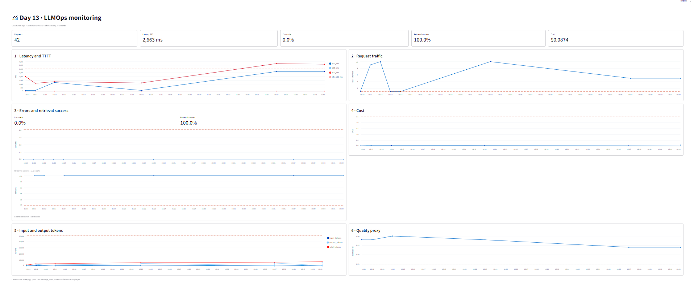

# Báo cáo cá nhân — K4-L3A Day 13 Monitoring & LLMOps

> Mỗi học viên hoàn thiện một file duy nhất này. Khi dẫn evidence, dùng đường dẫn tương đối, ví dụ `evidence/07-trace-waterfall.png`.

## 1. Thông tin học viên

- **Họ và tên:** Đinh Trường An
- **MSSV:** 02393
- **Lớp:** K4-L3A
- **Repository URL:** https://github.com/dinhtruongan/-K4-L3A-Day13-DinhTruongAn-02393-Monitoring-LLMOps
- **Commit SHA nộp:** SHA của commit đầu trên [`main`](https://github.com/dinhtruongan/-K4-L3A-Day13-DinhTruongAn-02393-Monitoring-LLMOps/commits/main); xác nhận đúng SHA bằng `git log -1 --format=%H` và nộp cùng URL repository trên LMS.
- **Challenge ID:** `day13-k4-l3a-monitoring-llmops-v1`; đã chạy sau khi slide CP3 xác nhận challenge chính thức bắt đầu.
- **Tên project Langfuse cá nhân:** `day13-k4-l3a-02393`

## 2. Evidence index

Điền đúng đường dẫn tới evidence thực tế. Có thể đổi tên hoặc dùng nhiều ảnh nếu cần.

| Evidence | Đường dẫn |
|---|---|
| 01 Tests cuối | [01-pytest.txt](evidence/01-pytest.txt) |
| 02 Log validator cuối | [02-log-validator.txt](evidence/02-log-validator.txt) |
| 03 Dashboard validator | [03-dashboard-validator.txt](evidence/03-dashboard-validator.txt) |
| 04 Structured log | [04-structured-log.txt](evidence/04-structured-log.txt) |
| 05 PII redaction | [05-pii-redaction.txt](evidence/05-pii-redaction.txt) |
| 06 Trace list (10 trace CP2) | [cp2-waterfall-observations.txt](evidence/cp2-waterfall-observations.txt) |
| 07 Trace waterfall | [07-trace-waterfall.png](evidence/07-trace-waterfall.png) |
| 08 Trace metadata, token và cost | [08-trace-metadata.png](evidence/08-trace-metadata.png) |
| 09 Prompt versions và labels | [09-prompt-versions.png](evidence/09-prompt-versions.png), [prompt-versioning-results.txt](evidence/prompt-versioning-results.txt) |
| 10 Promote/rollback production | [prompt-versioning-results.txt](evidence/prompt-versioning-results.txt) |
| 11 Dashboard runtime |  |
| Dashboard runtime snapshot (text) | [11-dashboard-overview.txt](evidence/11-dashboard-overview.txt) |
| 12 Incident metric | [12-incident-metric.txt](evidence/12-incident-metric.txt) |
| 13 Incident log/correlation ID | [13-incident-log.txt](evidence/13-incident-log.txt) |
| 14 Incident trace/span | [14-incident-trace.txt](evidence/14-incident-trace.txt) |
| Validators/pytest blocker history | [cp4-pytest-default-temp-blocker.txt](evidence/cp4-pytest-default-temp-blocker.txt), [cp3-final-log-validator.txt](evidence/cp3-final-log-validator.txt) |

Practice evidence (không thay thế evidence challenge chính thức): `evidence/practice-cp3-metric.txt`, `evidence/practice-cp3-log.txt`, `evidence/practice-cp3-trace.txt`.

## 3. Kết quả kỹ thuật

| Nội dung | Baseline | Kết quả cuối | Nhận xét |
|---|---|---|---|
| `validate_logs.py` | CP0: 30/100 trên 26 records | CP4: 100/100 trên 115 records, 56 correlation ID, 0 lỗi field/enrichment, 0 PII leak | CP1 sau reset riêng: 100/100 trên 21 records. Baseline 42 records được lưu trước khi đổi log. |
| `validate_dashboard.py` | HỢP LỆ: 6/6 panel | HỢP LỆ: 6/6 panel | Có đúng sáu panel với threshold contract. |
| `pytest` | 22 passed với temp dir riêng | CP4: 27 passed, 1 warning | Windows chặn Temp mặc định; dùng `--basetemp` với temp dir riêng để chạy đủ test. Có một cảnh báo deprecation từ Starlette. |
| Số traces hợp lệ | 10 trace ID mới, 10 root observations `lab-agent-run` | CP2: 10 waterfall trace; CP3: 5 waterfall trace chính thức | Root có child retriever + generation; generation có prompt, model, usage và cost. |
| Số PII leak | 0 | 0 | Log validator CP4 không phát hiện PII thô. |
| Latency P95 / TTFT P95 | CP0 P95 2,512 ms | Dashboard screenshot 60 phút: P95 2,663 ms; TTFT P95 50 ms | Runtime dashboard screenshot hiển thị 42 requests. Challenge metric theo minute bucket xem mục CP3. |
| Retrieval success rate | | 100% | Từ runtime dashboard có 42 requests. |

### CP0 — Baseline (2026-09-29)

- Health check `http://127.0.0.1:8000/health`: `ok=true`, `tracing_enabled=true`.
- Load test: 10/10 request trả HTTP 200; response hiện `correlation_id=MISSING` ở baseline.
- `data/logs.jsonl` được tạo/cập nhật; validator đọc 26 records (bao gồm log đã có trước lượt baseline này).
- Dashboard contract hợp lệ 6/6 panel.
- Langfuse: sau load test có 10 trace ID mới với root observation `lab-agent-run`, truy vấn bằng credential trong `.env`.
- Pytest: 22 passed khi chuyển pytest temp sang `.pytest-baseline-tmp` do quyền truy cập thư mục Temp mặc định của Windows.

### CP1 — Structured logging và PII (2026-09-29)

- Middleware xóa context cũ trước mỗi request, nhận `x-request-id` hợp lệ hoặc sinh `req-<8 hex>`, bind correlation ID và trả `x-request-id` cùng `x-response-time-ms`.
- API bind `user_id_hash`, `session_id`, `feature`, `model`, `env` trước log `request_received`.
- PII scrubber chạy trước JSONL file writer và JSON renderer; scrub đệ quy các chuỗi trong event, payload, list và object lồng nhau.
- Bổ sung test cho email, số điện thoại Việt Nam, CCCD, thẻ thanh toán; middleware cũng được kiểm tra với ID truyền vào và ID tự sinh.
- Xóa log CP0 theo yêu cầu, để Uvicorn `--reload` nạp code mới, rồi chạy lại load test. `validate_logs.py`: 100/100 trên 21 records, 10 correlation ID, không thiếu field/enrichment và không phát hiện PII. Baseline trước reset đạt 100/100 trên 42 records; xem `evidence/cp1-baseline-log-validator.txt` và `evidence/cp1-final-log-validator.txt`.
- Kiểm tra response header: `x-request-id` theo dạng `req-<8 hex>`; `x-response-time-ms` là số mili giây.
- Kiểm thử toàn bộ: 27 passed.

## 4. Logging và PII

- **Correlation ID:** middleware xóa context trước request, lấy `x-request-id` hợp lệ hoặc sinh `req-<8 hex>`, bind ID và trả `x-request-id` cùng `x-response-time-ms`.
- **Structured log:** request/response event gồm timestamp, event, correlation ID, `user_id_hash`, session, feature, model, env; response bổ sung latency, TTFT, tokens, cost, quality và retrieval status.
- **PII scrub:** processor đệ quy chạy trước file writer và JSON renderer; pattern che email, điện thoại Việt Nam, CCCD và thẻ thanh toán. Không log raw request/response trong trace.
- **Kiểm chứng:** evidence `04-structured-log.txt` có các trường bắt buộc; `05-pii-redaction.txt` chỉ có giá trị redacted. Validator CP1 sau reset đạt 100/100 trên 21 records; kết quả cuối đạt 100/100 trên 115 records.

## 5. Tracing và prompt versioning

- **Project cá nhân:** `day13-k4-l3a-02393`; xác nhận từ Langfuse API và giao diện project.
- **Prompt:** `day13-chat` dạng text; giữ nguyên ba biến `feature`, `docs`, `message`.
- **v1 / baseline:** nội dung `Feature={{feature}}`, `Docs={{docs}}`, `Question={{message}}`; labels cuối `baseline`, `production`.
- **v2 / candidate:** thêm hướng dẫn “Answer in no more than three concise bullet points.”; label cuối `candidate`.
- **Trace baseline:** `0a9c41bb7c515db3384535795b47270b`, correlation ID `req-72359bc6`, label `baseline`, version 1, `prompt_source=langfuse`.
- **Trace candidate:** `a2c3508288304648499c69751397e482`, correlation ID `req-55f7856e`, label `candidate`, version 2, `prompt_source=langfuse`.
- **Promote production → v2:** trace `8f21240d71c3d7c6be0372447e61c16e`, correlation ID `req-4bfa9745`, version 2.
- **Rollback production → v1:** trace `8a49eb6f21e9429557f08d5fa0ad85e4`, correlation ID `req-30945a10`, version 1. Traces baseline/candidate dùng cùng workload 10 câu hỏi; promote/rollback dùng cùng sample request.
- Evidence text và correlation/trace IDs: `evidence/prompt-versioning-results.txt`. Load test: `evidence/prompt-baseline-load-test.txt`, `evidence/prompt-candidate-load-test.txt`. Trang prompt: https://cloud.langfuse.com/project/cmumcprv81z2oad0f2c1cbynk/prompts/day13-chat.
- 10 trace mới có root `lab-agent-run` với hai child `retriever` và `fake-llm-generation`. Child IDs, parent IDs, prompt link, usage và cost được ghi trong `evidence/cp2-waterfall-observations.txt`; không observation nào capture raw input/output.

## 6. Dashboard, SLO và alerts

- **Dashboard runtime:** [`dashboard.py`](../dashboard.py) đọc `data/logs.jsonl`, lọc rolling 60 phút, refresh 30 giây. Sáu panel: latency P50/P95/P99 và TTFT (ms, SLO 3,000 ms); traffic (request/phút, ≥1); error rate, breakdown và retrieval success (%; error ≤2%, retrieval ≥90%); cost (USD, ≤2.5); input/output tokens (≤50,000); quality proxy (0–1, ≥0.75). Mỗi panel có threshold line và đơn vị. Contract ở [`config/dashboard.yaml`](../config/dashboard.yaml); cấu trúc được kiểm tra 6/6.
- **SLO chính:** request-based `fast_successful_requests`, rolling 28 ngày; request tốt là request nhận được phản hồi thành công trong ≤3 giây; target 99.5%. Cấu hình: [`config/slo.yaml`](../config/slo.yaml).
- **Error budget:** 0.5% request lỗi/vi phạm latency; với 1,000 request, ngân sách là 5 request xấu. Mốc 3 giây cao hơn baseline P95 2.512 giây; challenge chính thức ghi nhận một request 3.617 giây.
- **Alerts:** latency P95 >3,000 ms trong 5 phút (warning); error rate >2% trong 5 phút (critical); quality proxy trung bình <0.75 trong 15 phút (warning). Cả ba định tuyến `#day13-llmops-alerts`, có owner và runbook tại [`docs/alerts.md`](../docs/alerts.md); cấu hình ở [`config/alert_rules.yaml`](../config/alert_rules.yaml).
- **Hạn chế:** `#day13-llmops-alerts` là channel contract cho bài lab; cần nối channel thật ở hệ thống alert trước khi triển khai. Quality score là heuristic proxy, cần đánh giá người dùng/dataset để xác nhận.

## 7. Điều tra challenge

- **Challenge ID/cohort:** `day13-k4-l3a-monitoring-llmops-v1` / K4. Challenge JSON của Lab Coach được dùng nguyên nội dung, chỉ đặt bản sao tại đường dẫn `config/challenge.json` mà starter scripts yêu cầu; cả hai tên file đều bị Git ignore.
- **Thời gian bất thường:** 2026-09-29 16:42:26–16:42:42 Asia/Ho_Chi_Minh (09:42:26–09:42:42 UTC), feature `monitoring`.
- **Metric:** latency P95 theo minute bucket là 3,617 ms trên 5 request, cao hơn challenge threshold 2,000 ms; 1/5 request vượt SLO latency 3,000 ms. P50 2,653 ms; TTFT 50 ms; cả 5 request HTTP 200.
- **Log/correlation ID:** `response_sent`, `latency_ms=3617`, `tool_name=retrieval`, `tool_success=true`, `correlation_id=req-1d98fe1a`.
- **Trace:** `fd8caa5fd9696fd956730c80ed452208`, cùng correlation ID. Root `lab-agent-run` 3.618 s; child `retriever` 2.501 s; child `fake-llm-generation` 0.159 s. Hai child cùng parent root; evidence liệt kê trace IDs cho cả 5 request.
- **Root cause:** incident chính thức `rag_slow` thêm 2.5 giây chờ trong bước `retrieve()`. Retrieval chiếm phần lớn thời gian root; generation chỉ khoảng 159 ms.
- **Fix action:** đã gọi disable incident sau khi hoàn tất load test và xác nhận cả ba incident đều tắt. Với retrieval chậm thực tế, tối ưu vector-store call/cache và đặt timeout có giới hạn.
- **Preventive measure:** giữ alert latency P95 theo symptom, theo dõi retrieval riêng bằng child span và dùng correlation ID nối dashboard → structured log → trace. Không đưa nội dung câu hỏi challenge vào evidence.
- **Evidence:** `evidence/12-incident-metric.txt`, `evidence/13-incident-log.txt`, `evidence/14-incident-trace.txt`; validator log sau workload ở `evidence/cp3-final-log-validator.txt`.

## 8. Giải thích và tự đánh giá

- **Quyết định kỹ thuật:** dùng correlation ID xuyên log/trace; ẩn input/output nhưng giữ metadata và child spans để điều tra mà không lưu nội dung thô. Phần triển khai: [`app/middleware.py`](../app/middleware.py), [`app/logging_config.py`](../app/logging_config.py), [`app/pii.py`](../app/pii.py), [`app/agent.py`](../app/agent.py), [`app/mock_rag.py`](../app/mock_rag.py), [`app/mock_llm.py`](../app/mock_llm.py); test: [`tests/test_middleware.py`](../tests/test_middleware.py), [`tests/test_pii.py`](../tests/test_pii.py).
- **Lỗi/blocker:** Windows từ chối thư mục pytest Temp mặc định (lệnh mặc định báo 23 passed, 4 lỗi setup do `PermissionError`); dùng `--basetemp` với temp dir riêng, kết quả cuối 27 passed. Langfuse Cloud đã tắt legacy trace list API cho project này, nên truy vấn trace dùng Observations API v2. Xem [`evidence/cp4-pytest-default-temp-blocker.txt`](evidence/cp4-pytest-default-temp-blocker.txt) và [`evidence/01-pytest.txt`](evidence/01-pytest.txt).
- **Metrics → Logs → Traces:** dashboard phát hiện latency bất thường, correlation ID chọn đúng log request, trace cho thấy thời lượng retrieval và generation.
- **Prompt/version/cost/SLO:** labels tách baseline/candidate/production; generation observation ghi model, prompt version, tokens và cost. Error budget 0.5% giúp định lượng request xấu được phép trong chu kỳ 28 ngày.
- **Bài học:** hash user ID và redact nội dung phải xảy ra trước khi telemetry rời ứng dụng; prompt rollback cần trace v2 và v1 để xác minh.
- **Hạn chế còn lại:** trace list và prompt rollback còn được hỗ trợ bằng output text; ảnh Langfuse hiện có cho thấy waterfall/metadata và prompt versions. Slack channel trong YAML là contract chưa được nối alert receiver thật; quality score hiện là heuristic proxy.

## 9. Checklist trước khi nộp

- [ ] Kết quả và evidence thuộc commit SHA cuối.
- [x] Evidence được dẫn bằng đường dẫn tương đối; dashboard PNG và các output text mở được.
- [x] Incident evidence nối đúng metric → log → trace.
- [x] Trace/prompt evidence thuộc project Langfuse cá nhân; output text không chứa key/secret.
- [x] Repository chạy lại được theo README.
- [x] Không có secret, API key, PII thô hoặc evidence của người khác/lớp khác; challenge files bị ignore.
- [ ] URL repo và commit SHA cuối đã được nộp trên LMS/Codelabs.
